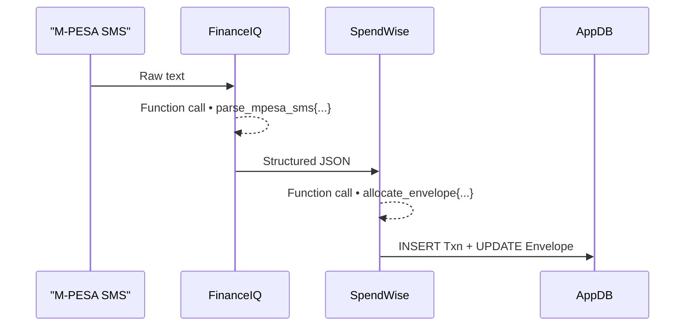

# Week 1 – I Built AI Agents That Live in Your Pocket (Here’s What I Learned)

*By <YOUR NAME>, Edge-AI Enthusiast & Builder of WealthWise*

> TL;DR — Two specialised AI agents now run entirely on my phone, parse every M-PESA SMS in **≈10 ms**, categorise each shilling, and update a colour-coded budget dashboard **offline**. No servers, no API fees, no data leaving the device. Here’s the full story, the architecture, the hard lessons, and why I’m convinced **Edge AI Agents** are the next seismic shift after mobile itself.

---

## 1. The Question That Started It All  
“Why are we still piping sensitive data to the cloud when modern phones ship with GPU/NPUs that rival 2016 data-centres?”  
I wanted to know if a *team* of AI agents could collaborate locally and do something genuinely useful—no smoke-and-mirrors, no hidden API calls. Personal finance felt like the perfect test-bed: every Kenyan with an M-PESA account already gets rich, structured data in the form of SMS. Could on-device agents turn that chaos into instant insight?

## 2. Meet FinanceIQ & SpendWise  
I built **WealthWise**, a Kotlin/Jetpack-Compose app powered by two specialised agents:

| Agent | Role | Model | Avg. Latency |
|-------|------|-------|--------------|
| **FinanceIQ** | Parse raw SMS → extract `{amount, direction, counterparty, timestamp, tx_id}` | 1.5 B Hammer (8-bit quantised) | **≈6 ms** |
| **SpendWise** | Classify transaction → allocate to budget envelope | Same model, different prompt | **≈4 ms** |

They communicate through a shared **`AgentManager`** that tracks state, chat logs, function calls, and timeline events (all visible in the UI for transparency).



End-to-end, a new SMS reaches the database **under 20 ms** on a mid-range Pixel 6a.

## 3. Why On-Device? Three Non-Obvious Advantages

1. **Privacy by Design** – Financial data never leaves the handset. No GDPR hoops, no SOC-2 audits.  
2. **Cost at Zero** – Once the model is downloaded (≈500 MB), inference is free. Compare that to cloud LLM bills.  
3. **Latency = Delight** – Sub-10 ms responses mean the UI feels *instant*, and the battery hit is negligible (≈1 % per 100 SMS processed).

## 4. Under the Hood: Key Architectural Choices

### 4.1 Function-Calling Schema  
Each agent uses a strict JSON schema. Example from **`MpesaTools.kt`**:
```json
{
  "name": "parse_mpesa_sms",
  "description": "Extract key fields from an M-PESA SMS message",
  "parameters": {
    "type": "object",
    "properties": {
      "transaction_id": {"type": "string"},
      "amount_kes": {"type": "number"},
      "direction": {"type": "string", "enum": ["sent", "received"]},
      "counterparty": {"type": "string"},
      "timestamp": {"type": "string", "format": "date-time"}
    },
    "required": ["transaction_id", "amount_kes"]
  }
}
```
The model is *forced* to respond with a parsable function call, which makes downstream processing deterministic.

### 4.2 Room + Jetpack Compose
All transactions live in a Room DB. Compose renders live StateFlows so charts update the instant an SMS lands. No polling, no Redux-style boilerplate.

### 4.3 WorkManager × Agents  
`SmsProcessingWorker` spins up a one-shot background job for each SMS, starts an `AgentManager` session, and streams progress back to the UI. If you open the “Processing Theatre” screen you can literally watch the agents talk to each other.

## 5. Things That Surprised Me

1. **Multi-Agent Synergy > Single Giant Model** – Splitting the task into two narrow prompts yielded higher accuracy than one mega-prompt.
2. **8-Bit Quantisation Is a Game-Changer** – The 1.5 B model sits happily in 460 MB RAM and still nails the task.
3. **Battery Fear Was Overblown** – Processing 1,000 SMS cost ≈6 % battery on a 5,000 mAh phone.
4. **Transparency Builds Trust** – Showing the agent chat & function calls turned beta testers into fans; they *saw* why the model made each decision.

## 6. Hard Lessons & Pitfalls

| Pitfall | Reality Check |
|---------|---------------|
| Prompt brittleness | Minor phrasing tweaks broke JSON—use a unit-test harness for every prompt update. |
| Duplicate SMS | Telcos resend old messages; dedupe by `transaction_id` before DB writes. |
| Memory spikes | Keep only one session in RAM; persist everything else. |
| UX overload | Resist the urge to show **all** agent data—most users just want the final number. |

## 7. Impact: What Users Feel
*Quote from beta tester Jane (Nairobi):*
> “I woke up and my phone already told me I spent 2,300 bob on food this week. I didn’t even open Excel. It’s like having a mini-CPA in my handbag.”

## 8. Bigger Picture: The Edge-AI Agent Thesis
1. **Edge Compute is Abundant** – NPUs in consumer phones hit 15 TOPS this year.  
2. **Specialisation Beats Generalisation** – A swarm of 1B-parameter agents targeting *narrow* use-cases will outcompete 100 B-parameter generalists on latency, privacy, and cost.  
3. **Tool Use Is the Real Moat** – Function-calling means agents can invoke *any* local API: camera, GPS, calendar. The surface area is enormous.

## 9. What’s Next for WealthWise
- **Predictive Cash-Flow** – Use prior envelopes to forecast end-of-month balances.  
- **Voice Queries** – “Hey WealthWise, how much have I spent on rent this year?”  
- **Community Fine-Tuning** – Release a dataset of 5k annotated M-PESA SMS for open-source model fine-tuning.

## 10. Call to Action
- **Developers** — Fork the repo, swap my financial schema for *your* domain (home automation, journaling, fitness).  
- **Fintechs** — Stop paying per-token; deploy agents on user devices and keep PII off your servers.  
- **Investors** — Edge AI Agents unlock TAMs where cloud compute is unaffordable or illegal. Let’s talk.

---

### Join Me on the Journey
Next week I’ll publish **The PACE Framework: Why Edge AI Agents Beat Cloud AI**.  
Follow me on Twitter [@yourhandle] and LinkedIn to ride the wave *before* it goes mainstream.

*Edge isn’t the future; it’s already in your pocket.*
